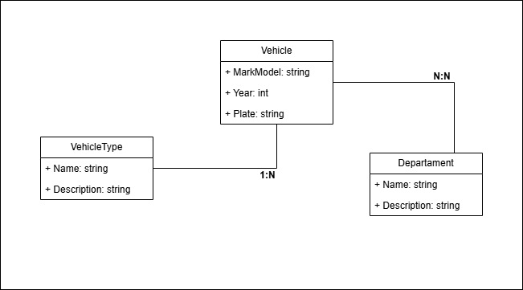

# [INATEL – Pós-graduação](https://inatel.br/) – [Desenvolvimento Mobile e Cloud Computing](https://inatel.br/pos/desenvolvimento-mobile-e-cloud-computing)

## Disciplina DM106 - Desenvolvimento de Web Services com Segurança sob a Plataforma .NET  

## Prof. Me. José Andery Carneiro

### Aluno [Vagner Nogueira](https://github.com/vagnernogueira) 

---

# Trabalho da Disciplina 

## Atividade proposta

(1) Diagrama de classes do seu projeto, similar ao InventarioMed, contendo obrigatoriamente três classes, A, B e C, sendo que a relação de A e B é de (1:N) e a relação de A e C é de (N:N). Programa console do seu projeto, similar ao desenvolvido na aula.

(2) Adição de funcionalidades:

- Integração com ORM Entity Framework (não precisa refazer os passos ADO.NET)
- Classes Context e DAL de Shared.Data
- Desenvolva uma DAL genérica
- Crie um novo banco com Migrations, alimentando-o com dados
- Crie a relação entre as classes (1:N) utilizando Migrations e Proxies
- Configure e teste o método GET na sua API

---

### Entrega da Atividade 1

O diagrama de classes se encontra neste repositório assim como a implementação do projeto console. Para download do executável zipado, acesse a seção de releases deste repositório.

- [Branch aula-1.2](https://github.com/vagnernogueira/GestaoFrotaVeicular/tree/aula-1.2)
- [TAG v1 na branch master marcando último commit dessa atividade](https://github.com/vagnernogueira/GestaoFrotaVeicular/tree/v1)
- [Release v1](https://github.com/vagnernogueira/GestaoFrotaVeicular/releases/tag/v1)

---

### Entrega da Atividade 2

A implementação proposta se encontra neste repositório.

- [Branch aula-2.4](https://github.com/vagnernogueira/GestaoFrotaVeicular/tree/aula-2.4)
- [TAG v2 na branch master marcando último commit dessa atividade](https://github.com/vagnernogueira/GestaoFrotaVeicular/tree/v2)
- [Release v2](https://github.com/vagnernogueira/GestaoFrotaVeicular/releases/tag/v2)

---

# GestaoFrotaVeicular

**Descrição:**
O projeto "GestaoFrotaVeicular" é uma aplicação web desenvolvida em ASP.NET Core com o objetivo de gerenciar uma frota de veículos de uma empresa. Ele permitirá o cadastro e gerenciamento de veículos, tipos de veículos e alocações a departamentos ou projetos.

**Características Detalhadas:**

1.  **Entidade Principal:**
    * **Veículos:** Cadastro com informações como placa, modelo, fabricante, ano, quilometragem, data da última manutenção, status (disponível, em uso, em manutenção).

2.  **Entidade de Categorização:**
    * **Tipos de Veículo:** Cada veículo pertencerá a um único tipo (relação 1:N), como carro de passeio, caminhonete, furgão, caminhão leve, motocicleta.

3.  **Entidade de Alocação/Associação:**
    * **Departamentos/Projetos:** Veículos poderão ser alocados a múltiplos departamentos da empresa (ex: Vendas, Logística, Manutenção) ou a projetos específicos (relação N:N). Um departamento/projeto pode utilizar diversos veículos, e um veículo pode ser utilizado por/para múltiplos departamentos/projetos (talvez não simultaneamente, mas ao longo do tempo ou com compartilhamento).

4.  **Funcionalidades:**
    * CRUD (Create, Read, Update, Delete) completo para Veículos, Tipos de Veículo e Departamentos/Projetos.

5.  **Tecnologias de Acesso a Dados:**
    * Utilização do Entity Framework para mapeamento objeto-relacional.
    * ADO.NET para acesso direto a dados onde for pertinente (ex: relatórios complexos, procedures otimizadas).

6.  **Segurança:**
    * Implementação de autenticação e autorização para controlar o acesso às funcionalidades do sistema (ex: apenas gestores de frota podem cadastrar veículos, usuários comuns podem apenas visualizar).

7.  **Deployment:**
    * Deploy na plataforma Microsoft Azure, visando escalabilidade e alta disponibilidade.

8.  **Objetivo de Aprendizagem:**
    * Consolidar uma visão completa sobre o desenvolvimento de Web Services seguros e escaláveis, aplicando os conceitos aprendidos diretamente em um projeto com relevância prática para gestão empresarial.

# Diagrama de Classes

 

---
